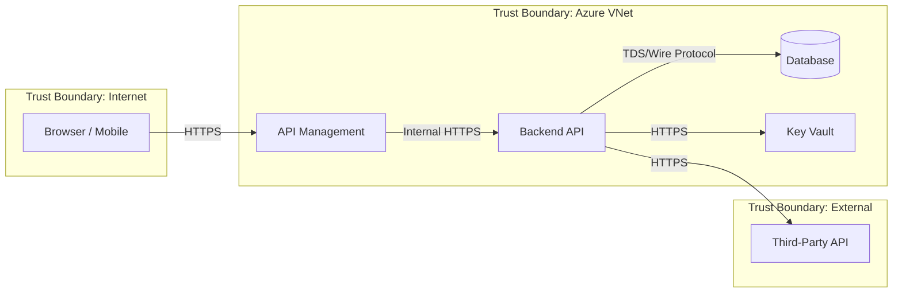

# Threat Modelling Skill

Provides structured threat modelling workflows using STRIDE classification and DREAD scoring, tailored for Azure cloud-native architectures. Produces actionable threat registers, data flow diagrams, and mitigation tracking that integrate with ADRs and security reviews.

## When to Use This Skill

| Trigger                                      | Use Case                                              |
| -------------------------------------------- | ----------------------------------------------------- |
| "Create a threat model for..."               | New system or feature threat analysis                 |
| "What are the threats to this architecture?" | Architecture-level security review                    |
| "STRIDE analysis for..."                     | Systematic threat classification                      |
| "Identify trust boundaries"                  | Data flow and boundary mapping                        |
| "Risk assessment for..."                     | DREAD scoring for identified threats                  |
| Pre-production security review               | Compliance-driven threat modelling (SOC 2, ISO 27001) |
| New external integration / third-party API   | Attack surface expansion review                       |

---

## Threat Modelling Process

### Step 1: Define Scope and Assets

Before modelling threats, answer these questions:

1. **What are we building?** System name, purpose, key features
2. **What data does it handle?** Classification: Public / Internal / Confidential / Highly Confidential
3. **Who are the actors?** End users, admins, external systems, background jobs
4. **What are the crown jewels?** Assets that, if compromised, cause the most damage
5. **What is the deployment model?** Azure services, networking, identity providers

### Step 2: Create a Data Flow Diagram (DFD)

Map the system using these element types:

| Symbol         | Element         | Example                                       |
| -------------- | --------------- | --------------------------------------------- |
| Rectangle      | External Entity | Browser, mobile app, third-party API          |
| Circle         | Process         | ASP.NET API, Azure Function, Container App    |
| Parallel lines | Data Store      | Azure SQL, Cosmos DB, Blob Storage, Key Vault |
| Arrow          | Data Flow       | HTTPS request, Service Bus message, gRPC call |
| Dashed line    | Trust Boundary  | VNet perimeter, subscription, identity realm  |

#### DFD Template (Mermaid)



### Step 3: Identify Trust Boundaries

Trust boundaries are where data crosses from one trust level to another. Every trust boundary crossing is a potential attack surface.

#### Common Azure Trust Boundaries

| Boundary                      | Crosses Between                                   | Key Threats                                                                              |
| ----------------------------- | ------------------------------------------------- | ---------------------------------------------------------------------------------------- |
| Internet ↔ Azure VNet         | Untrusted → Network perimeter                     | DDoS, injection, credential theft                                                        |
| VNet ↔ PaaS service           | Network perimeter → managed service               | SSRF, token replay, misconfigured RBAC                                                   |
| Subscription ↔ Subscription   | Organizational isolation boundary                 | Lateral movement, over-privileged identity                                               |
| User context ↔ System context | End-user identity → service identity              | Privilege escalation, BOLA                                                               |
| Application ↔ External API    | Your control → third-party control                | Supply chain, data leakage, availability                                                 |
| Control Plane ↔ Data Plane    | Management operations → runtime traffic           | Config tampering, unauthorized deployment                                                |
| Build/Publish ↔ Distribution  | Internal build artifacts → public/client packages | Source code exposure, prompt leakage, debug artifact leakage, LLM-assisted deobfuscation |

### Step 4: Apply STRIDE Analysis

For **each trust boundary crossing** and **each major component**, classify threats using STRIDE:

| Category                   | Abbr | Question                                       | Azure Mitigation Pattern                                                       |
| -------------------------- | ---- | ---------------------------------------------- | ------------------------------------------------------------------------------ |
| **S**poofing               | S    | Can an attacker impersonate a legitimate user? | Entra ID + MFA, managed identity, validate-jwt policy, certificate pinning     |
| **T**ampering              | T    | Can data be modified in transit or at rest?    | TLS 1.2+, integrity hashes, immutable storage, Cosmos DB etag concurrency      |
| **R**epudiation            | R    | Can an actor deny performing an action?        | Audit logs (Entra ID, Activity Log), correlation IDs, immutable append ledger  |
| **I**nformation Disclosure | I    | Can data leak to unauthorized parties?         | Encryption at rest (CMK), Private Endpoints, Key Vault, data masking           |
| **D**enial of Service      | D    | Can the system be made unavailable?            | Rate limiting, auto-scaling, Azure DDoS Protection, circuit breakers           |
| **E**levation of Privilege | E    | Can an attacker gain higher privileges?        | Least-privilege RBAC, PIM, scope validation in JWT, no shared service accounts |

#### STRIDE Worksheet Template

```markdown
## STRIDE Threat Register

### Threat: [T-001] JWT Token Replay

| Field               | Value                                               |
| ------------------- | --------------------------------------------------- |
| **Component**       | API Management → Backend API                        |
| **Boundary**        | Internet → VNet                                     |
| **STRIDE Category** | Spoofing (S)                                        |
| **Description**     | Stolen JWT used to impersonate legitimate user      |
| **Likelihood**      | Medium                                              |
| **Impact**          | High                                                |
| **DREAD Score**     | 8.0 (see scoring below)                             |
| **Mitigation**      | Short token lifetime (15 min), audience validation, |
|                     | `nbf`/`exp` enforcement, token binding              |
| **Status**          | ☐ Open / ☑ Mitigated / ☐ Accepted / ☐ Transferred   |
| **Owner**           | @security-team                                      |
| **ADR**             | ADR-0042 (JWT Token Policy)                         |
```

### Step 5: Score Threats with DREAD

Score each identified threat on five dimensions (1–10 scale):

| Dimension           | Question                            | 1 (Low)                 | 10 (High)                  |
| ------------------- | ----------------------------------- | ----------------------- | -------------------------- |
| **D**amage          | How bad is it if exploited?         | Minor data exposure     | Full system compromise     |
| **R**eproducibility | How easy to reproduce?              | Race condition, complex | Every time, simple request |
| **E**xploitability  | How easy to launch the attack?      | Requires insider access | Automated, no auth needed  |
| **A**ffected Users  | How many users impacted?            | Single user             | All users / system-wide    |
| **D**iscoverability | How easy to find the vulnerability? | Requires source code    | Publicly visible endpoint  |

**DREAD Score** = average of all five dimensions

| Score Range | Priority     | SLA                        |
| ----------- | ------------ | -------------------------- |
| 8.0 – 10.0  | **Critical** | Mitigate before deployment |
| 5.0 – 7.9   | **High**     | Mitigate within sprint     |
| 3.0 – 4.9   | **Medium**   | Schedule in backlog        |
| 1.0 – 2.9   | **Low**      | Accept or monitor          |

---

## Azure-Specific Threat Catalogue

Common threats for Azure cloud-native systems, pre-classified by STRIDE:

### Identity & Access

| ID    | Threat                               | STRIDE | Mitigation                                         |
| ----- | ------------------------------------ | ------ | -------------------------------------------------- |
| IA-01 | Over-privileged managed identity     | E      | Use `azure-role-selector` → minimal built-in role  |
| IA-02 | Shared service principal across envs | S, E   | Per-environment identity, federated credentials    |
| IA-03 | Missing MFA on admin accounts        | S      | Conditional Access policy, PIM for JIT activation  |
| IA-04 | Stale app registrations with secrets | S, I   | Workload identity federation, certificate rotation |

### Networking

| ID    | Threat                           | STRIDE | Mitigation                                                 |
| ----- | -------------------------------- | ------ | ---------------------------------------------------------- |
| NW-01 | Public endpoint on database      | I, T   | Private Endpoint, deny public access                       |
| NW-02 | Unrestricted NSG inbound rules   | D, E   | NSG deny-all default, allow only required ports/sources    |
| NW-03 | DNS rebinding via custom domains | S      | Validate `Host` header, managed domain verification        |
| NW-04 | SSRF via user-supplied URLs      | I, T   | Allowlist destinations, validate URL scheme, block RFC1918 |

### Data

| ID    | Threat                                  | STRIDE | Mitigation                                                   |
| ----- | --------------------------------------- | ------ | ------------------------------------------------------------ |
| DA-01 | Unencrypted data at rest                | I      | Service encryption + CMK where required by compliance        |
| DA-02 | PII in application logs                 | I, R   | Structured logging, PII scrubbing, App Insights data masking |
| DA-03 | Backup accessible to developers         | I, E   | RBAC on recovery services vault, break-glass procedure       |
| DA-04 | Hard-coded connection strings in config | I, S   | Key Vault references, managed identity connections           |

### Distribution & Build Artifacts

| ID    | Threat                                                       | STRIDE | Mitigation                                                                                                                               |
| ----- | ------------------------------------------------------------ | ------ | ---------------------------------------------------------------------------------------------------------------------------------------- |
| DI-01 | AI system prompts or tool definitions in published artifacts | I      | Classify prompts as Public/Confidential; load Confidential from App Config/Key Vault at runtime; exclude from packages and Docker images |
| DI-02 | Source maps or PDB files in production packages/images       | I      | Disable source maps for production; use symbol servers for PDBs; CI image inspection with `dive` or `docker history`                     |
| DI-03 | LLM-assisted deobfuscation of client-distributed code        | I      | Treat client code as public; keep IP server-side; obfuscation is not a security control                                                  |
| DI-04 | Secrets persisting in git history after deletion             | I, S   | Pre-commit hooks (gitleaks), push protection, full-repo scan on release; remediate with `git filter-repo` + credential rotation          |
| DI-05 | Server-side code bundled in npm/NuGet/PyPI packages          | I      | Use `files` allowlist (npm), `Pack="false"` (.NET); `npm pack --dry-run` / `dotnet pack` inspection in CI                                |
| DI-06 | CI/CD logs or artifacts leaking secrets                      | I      | `::add-mask::` for derived secrets; retention limits on artifacts; never echo secrets to logs                                            |

### Compute & Runtime

| ID    | Threat                                  | STRIDE | Mitigation                                                  |
| ----- | --------------------------------------- | ------ | ----------------------------------------------------------- |
| CR-01 | Container image from untrusted registry | T, E   | ACR-only pull, image signing with Notation/cosign           |
| CR-02 | Running as root in container            | E      | Non-root user in Dockerfile, `securityContext.runAsNonRoot` |
| CR-03 | Unpatched base image                    | E, I   | Dependabot for Docker, ACR Defender scanning                |
| CR-04 | Unrestricted egress from workload       | I, T   | Network Policy deny-all egress, allow specific endpoints    |

### Messaging & Integration

| ID    | Threat                        | STRIDE | Mitigation                                                 |
| ----- | ----------------------------- | ------ | ---------------------------------------------------------- |
| MI-01 | Message replay on Service Bus | T, R   | Duplicate detection, idempotent handlers, message IDs      |
| MI-02 | Webhook payload tampering     | T, S   | HMAC signature verification, timestamp validation (±5 min) |
| MI-03 | Poison message infinite retry | D      | Max delivery count, dead-letter queue, alerting            |

---

## Output Format

A completed threat model produces these deliverables:

### 1. Threat Model Summary Document

Save to `agent-output/{project}/threat-model-{date}.md`:

```markdown
# Threat Model: {System Name}

**Date:** {YYYY-MM-DD}
**Author:** {team/person}
**Scope:** {what's in/out of scope}
**Data Classification:** {Public / Internal / Confidential / Highly Confidential}

## System Overview

{Brief description and purpose}

## Data Flow Diagram

{Mermaid DFD or link to .drawio file}

## Trust Boundaries

{Table of identified boundaries}

## Threat Register

{STRIDE worksheet entries with DREAD scores}

## Risk Summary

| Priority | Count | Status                   |
| -------- | ----- | ------------------------ |
| Critical | X     | All mitigated            |
| High     | X     | Y mitigated, Z in-sprint |
| Medium   | X     | Backlogged               |
| Low      | X     | Accepted                 |

## Mitigations & ADR References

{Link each mitigation to implementation / ADR}

## Review Cadence

- Next review: {date or trigger event}
- Trigger for re-assessment: new external integration, architecture change, compliance audit
```

### 2. Threat Register (structured)

For tracking in backlogs, output a structured list:

```markdown
| ID    | Threat             | STRIDE | DREAD | Priority | Mitigation         | Status    | Owner       |
| ----- | ------------------ | ------ | ----- | -------- | ------------------ | --------- | ----------- |
| T-001 | JWT replay         | S      | 8.0   | Critical | Short-lived tokens | Mitigated | @sec-team   |
| T-002 | Public DB endpoint | I, T   | 9.2   | Critical | Private Endpoint   | Mitigated | @infra-team |
| T-003 | Overprivileged MI  | E      | 6.5   | High     | Scope to role      | Open      | @dev-team   |
```

---

## When to Reassess

- New external-facing endpoint or API
- New third-party integration or dependency
- Architecture change crossing new trust boundary
- Compliance audit or certification renewal
- Post-incident review (threat was missed)
- Major framework or runtime version upgrade

---

## Guardrails

> ⚠️ **Don't model everything.** Focus on trust boundary crossings and crown jewels. A 200-row threat register with all "Low" scores adds noise, not value.

> ⚠️ **Don't skip DREAD scoring.** Without quantified risk, all threats feel equally urgent. The score drives prioritization and SLA.

> ⚠️ **Threat models are living documents.** A threat model created at design time and never revisited is a false sense of security. Set a review cadence.

> ⚠️ **Mitigations need owners and status tracking.** An identified threat with "TODO: fix later" is worse than no threat model. It creates documented negligence.

---

## MCP Tools

### 1. Azure Security Best Practices

```
Tool: mcp_azure_mcp_get_azure_bestpractices
Intent: "Azure threat modelling security best practices"
```

### 2. Microsoft Learn — SDL Threat Modelling

```
Tool: mcp_microsoft_doc_microsoft_docs_search
Query: "Microsoft SDL threat model STRIDE Azure"
```

---

## Related Skills

- [api-security-review](../api-security-review/SKILL.md) — Runtime security audit (OWASP API Top 10, controls checklist)
- [azure-adr](../azure-adr/SKILL.md) — Document threat mitigation decisions as ADRs
- [private-networking](../private-networking/SKILL.md) — Network trust boundary implementation
- [identity-managed-identity](../identity-managed-identity/SKILL.md) — Identity threat mitigations
- [secret-management](../secret-management/SKILL.md) — Secret-related threat mitigations
- [waf-assessment](../waf-assessment/SKILL.md) — WAF Security pillar alignment

---

## Currency

- **Date checked:** 2026-03-31
- **Sources:** Microsoft Learn MCP (`microsoft_docs_search`), [OWASP Threat Modeling](https://owasp.org/www-community/Threat_Modeling)
- **Authoritative references:** [Microsoft SDL Threat Modeling](https://learn.microsoft.com/azure/security/develop/threat-modeling-tool), [STRIDE](https://learn.microsoft.com/azure/security/develop/threat-modeling-tool-threats)

### Verification Steps

1. Confirm STRIDE categories and Microsoft SDL threat modeling tool availability
2. Verify OWASP threat modeling methodology version is current
3. Check for new Azure-specific threat catalogs or automated threat modeling tools
